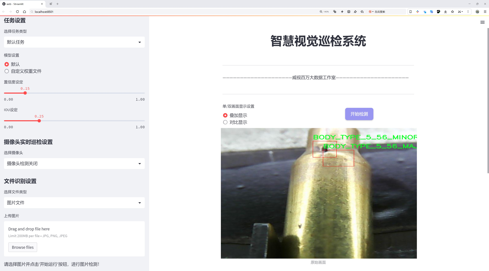
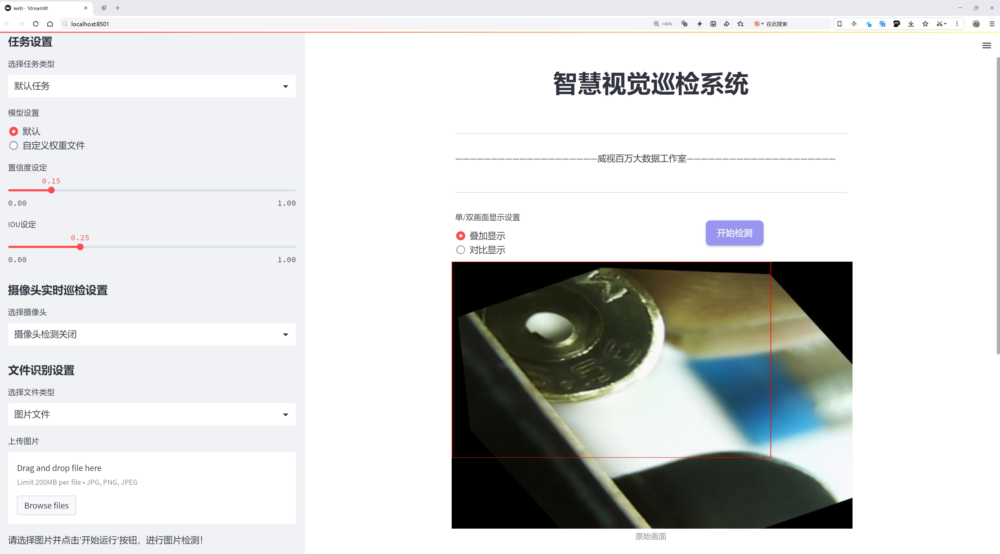
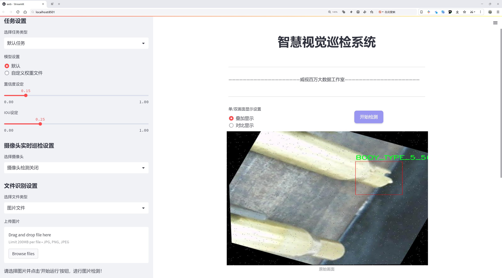
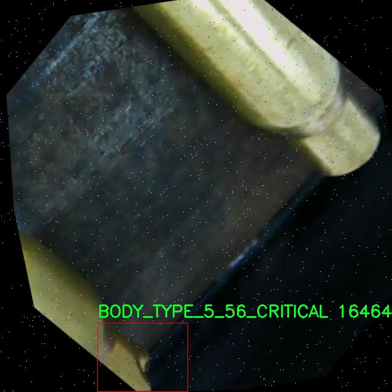
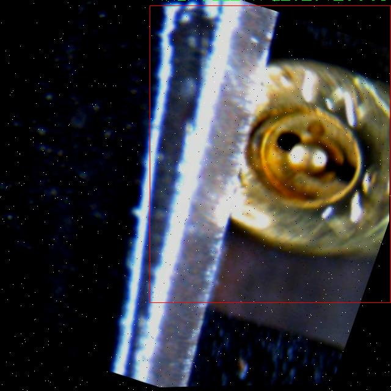
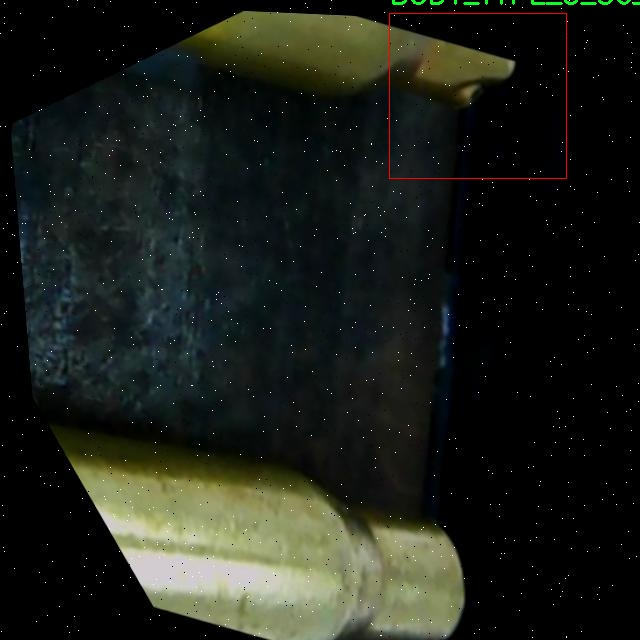
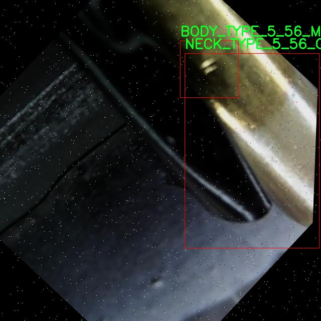
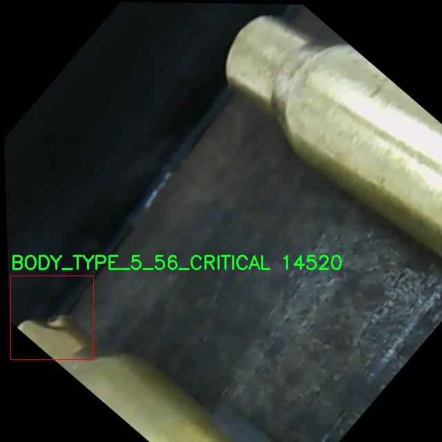

# 子弹生产线残次品检测系统源码分享
 # [一条龙教学YOLOV8标注好的数据集一键训练_70+全套改进创新点发刊_Web前端展示]

### 1.研究背景与意义

项目参考[AAAI Association for the Advancement of Artificial Intelligence](https://gitee.com/qunmasj/projects)

项目来源[AACV Association for the Advancement of Computer Vision](https://kdocs.cn/l/cszuIiCKVNis)

研究背景与意义

随着科技的不断进步，自动化生产线在各个行业中得到了广泛应用，尤其是在制造业中，自动化技术的引入极大地提高了生产效率和产品质量。然而，生产过程中难免会出现残次品，这不仅影响了产品的整体质量，还可能对企业的经济效益造成负面影响。因此，如何有效地检测和剔除生产线上的残次品，成为了制造业亟待解决的重要课题。

在子弹生产领域，产品的质量直接关系到其安全性和可靠性。根据相关研究，子弹的各个组成部分，如弹壳、火孔和弹头等，均需达到严格的质量标准，以确保其在使用过程中的性能。因此，针对子弹生产线的残次品检测，必须采用高效、准确的检测系统，以便及时发现并处理不合格产品。传统的人工检测方法不仅耗时耗力，而且容易受到人为因素的影响，导致漏检或误检的情况发生。因此，基于计算机视觉和深度学习技术的自动化检测系统应运而生，成为提升生产线检测效率和准确性的有效手段。

YOLO（You Only Look Once）系列模型因其高效的实时目标检测能力，已被广泛应用于各种物体检测任务中。YOLOv8作为该系列的最新版本，进一步提升了检测精度和速度，尤其适合于快速移动的生产线环境。然而，针对特定行业的应用，现有的YOLOv8模型仍需进行改进，以适应子弹生产线的特殊需求。因此，基于改进YOLOv8的子弹生产线残次品检测系统的研究具有重要的理论和实践意义。

本研究将利用一个包含3100张图像的数据集，涵盖了7个类别的子弹部件，包括不同质量等级的弹壳、火孔和弹头等。这些类别的细分不仅有助于提高检测的准确性，还能为后续的质量控制提供更为详尽的数据支持。通过对数据集的深入分析与处理，结合改进的YOLOv8模型，我们将能够实现对子弹生产线上的残次品进行高效、准确的检测，从而降低生产成本，提高产品质量。

此外，研究成果的推广应用，将为其他制造行业的残次品检测提供借鉴，推动智能制造的发展。随着人工智能技术的不断成熟，基于深度学习的检测系统将在更多领域展现出其强大的应用潜力。因此，本研究不仅具有重要的学术价值，还有助于推动制造业的技术进步和产业升级，具有广泛的社会和经济意义。通过建立高效的残次品检测系统，我们期望能够为提升子弹生产的整体质量水平做出贡献，确保最终产品的安全性和可靠性，从而更好地服务于市场需求。

### 2.图片演示







##### 注意：由于此博客编辑较早，上面“2.图片演示”和“3.视频演示”展示的系统图片或者视频可能为老版本，新版本在老版本的基础上升级如下：（实际效果以升级的新版本为准）

  （1）适配了YOLOV8的“目标检测”模型和“实例分割”模型，通过加载相应的权重（.pt）文件即可自适应加载模型。

  （2）支持“图片识别”、“视频识别”、“摄像头实时识别”三种识别模式。

  （3）支持“图片识别”、“视频识别”、“摄像头实时识别”三种识别结果保存导出，解决手动导出（容易卡顿出现爆内存）存在的问题，识别完自动保存结果并导出到tempDir中。

  （4）支持Web前端系统中的标题、背景图等自定义修改，后面提供修改教程。

  另外本项目提供训练的数据集和训练教程,暂不提供权重文件（best.pt）,需要您按照教程进行训练后实现图片演示和Web前端界面演示的效果。

### 3.视频演示

[3.1 视频演示](https://www.bilibili.com/video/BV1za11YmEVz/)

### 4.数据集信息展示

##### 4.1 本项目数据集详细数据（类别数＆类别名）

nc: 7
names: ['BODY_TYPE_5_56_CRITICAL', 'BODY_TYPE_5_56_MAJOR', 'BODY_TYPE_5_56_MINOR', 'FIREHOLE_TYPE_5_56_CRITICAL', 'FIREHOLE_TYPE_5_56_GOOD', 'NECK_TYPE_5_56_CRITICAL', 'NECK_TYPE_5_56_GOOD']


##### 4.2 本项目数据集信息介绍

数据集信息展示

在现代制造业中，尤其是在子弹生产线的质量控制环节，准确高效的残次品检测系统显得尤为重要。为此，我们构建了一个名为“bbji-2”的数据集，旨在为改进YOLOv8模型提供丰富的训练数据，以提升其在子弹生产过程中对残次品的检测能力。该数据集专注于子弹的不同部件，通过对每个部件的细致分类，确保检测系统能够精准识别出潜在的缺陷。

“bbji-2”数据集包含七个类别，分别为：BODY_TYPE_5_56_CRITICAL、BODY_TYPE_5_56_MAJOR、BODY_TYPE_5_56_MINOR、FIREHOLE_TYPE_5_56_CRITICAL、FIREHOLE_TYPE_5_56_GOOD、NECK_TYPE_5_56_CRITICAL和NECK_TYPE_5_56_GOOD。这些类别涵盖了子弹的主要结构和功能部件，每个类别都对应着不同的质量标准和缺陷程度。具体而言，BODY_TYPE_5_56_CRITICAL、BODY_TYPE_5_56_MAJOR和BODY_TYPE_5_56_MINOR分别代表了子弹主体在不同质量水平下的缺陷情况，其中“CRITICAL”表示严重缺陷，可能导致子弹在使用过程中的失效，而“MAJOR”和“MINOR”则分别对应中等和轻微的缺陷，影响子弹的性能和安全性。

在火孔部分，FIREHOLE_TYPE_5_56_CRITICAL和FIREHOLE_TYPE_5_56_GOOD则是对火孔质量的评估。火孔是子弹发射过程中至关重要的部件，其质量直接影响到发射的稳定性和准确性。FIREHOLE_TYPE_5_56_CRITICAL表示火孔存在严重缺陷，可能导致发射失败或安全隐患，而FIREHOLE_TYPE_5_56_GOOD则表示该部件的质量符合标准，适合使用。

最后，NECK_TYPE_5_56_CRITICAL和NECK_TYPE_5_56_GOOD则是针对子弹颈部的质量评估。颈部的结构完整性对于子弹的装填和发射同样至关重要，NECK_TYPE_5_56_CRITICAL标识出存在严重缺陷的颈部，而NECK_TYPE_5_56_GOOD则表明该部件的质量是合格的。

整个“bbji-2”数据集不仅涵盖了子弹的各个关键部件，还通过对缺陷的详细分类，为YOLOv8模型的训练提供了丰富的样本。这种多样化的标注方式，使得模型能够学习到不同缺陷特征之间的细微差别，从而在实际应用中更为精准地识别出残次品，降低生产过程中的风险，提高产品的整体质量。

在数据集的构建过程中，我们确保了数据的多样性和代表性，涵盖了不同生产批次和工艺条件下的样本，以增强模型的泛化能力。此外，数据集中的图像经过精心挑选和标注，确保每个类别的样本数量均衡，避免模型在训练过程中出现偏差。通过这样的设计，我们期望“bbji-2”数据集能够为子弹生产线的残次品检测系统提供强有力的支持，推动智能制造技术的发展。











### 5.全套项目环境部署视频教程（零基础手把手教学）

[5.1 环境部署教程链接（零基础手把手教学）](https://www.ixigua.com/7404473917358506534?logTag=c807d0cbc21c0ef59de5)


[5.2 安装Python虚拟环境创建和依赖库安装视频教程链接（零基础手把手教学）](https://www.ixigua.com/7404474678003106304?logTag=1f1041108cd1f708b01a)

### 6.手把手YOLOV8训练视频教程（零基础小白有手就能学会）

[6.1 手把手YOLOV8训练视频教程（零基础小白有手就能学会）](https://www.ixigua.com/7404477157818401292?logTag=d31a2dfd1983c9668658)


按照上面的训练视频教程链接加载项目提供的数据集，运行train.py即可开始训练



     Epoch   gpu_mem       box       obj       cls    labels  img_size
     1/200     20.8G   0.01576   0.01955  0.007536        22      1280: 100%|██████████| 849/849 [14:42<00:00,  1.04s/it]
               Class     Images     Labels          P          R     mAP@.5 mAP@.5:.95: 100%|██████████| 213/213 [01:14<00:00,  2.87it/s]
                 all       3395      17314      0.994      0.957      0.0957      0.0843

     Epoch   gpu_mem       box       obj       cls    labels  img_size
     2/200     20.8G   0.01578   0.01923  0.007006        22      1280: 100%|██████████| 849/849 [14:44<00:00,  1.04s/it]
               Class     Images     Labels          P          R     mAP@.5 mAP@.5:.95: 100%|██████████| 213/213 [01:12<00:00,  2.95it/s]
                 all       3395      17314      0.996      0.956      0.0957      0.0845

     Epoch   gpu_mem       box       obj       cls    labels  img_size
     3/200     20.8G   0.01561    0.0191  0.006895        27      1280: 100%|██████████| 849/849 [10:56<00:00,  1.29it/s]
               Class     Images     Labels          P          R     mAP@.5 mAP@.5:.95: 100%|███████   | 187/213 [00:52<00:00,  4.04it/s]
                 all       3395      17314      0.996      0.957      0.0957      0.0845


### 7.70+种全套YOLOV8创新点代码加载调参视频教程（一键加载写好的改进模型的配置文件）

[7.1 70+种全套YOLOV8创新点代码加载调参视频教程（一键加载写好的改进模型的配置文件）](https://www.ixigua.com/7404478314661806627?logTag=29066f8288e3f4eea3a4)

### 8.70+种全套YOLOV8创新点原理讲解（非科班也可以轻松写刊发刊，V10版本正在科研待更新）

#### 由于篇幅限制，每个创新点的具体原理讲解就不一一展开，具体见下列网址中的创新点对应子项目的技术原理博客网址【Blog】：


[8.1 70+种全套YOLOV8创新点原理讲解链接](https://gitee.com/qunmasj/good)

#### 部分改进原理讲解(完整的改进原理见上图和技术博客链接)
### 深度学习基础
卷积神经网络通过使用具有共享参数的卷积运算显著降低了模型的计算开销和复杂性。在LeNet、AlexNet和VGG等经典网络的驱动下，卷积神经网络现在已经建立了一个完整的系统，并在深度学习领域形成了先进的卷积神经网络模型。

感受野注意力卷积RFCBAMConv的作者在仔细研究了卷积运算之后获得了灵感。对于分类、目标检测和语义分割任务，一方面，图像中不同位置的对象的形状、大小、颜色和分布是可变的。在卷积操作期间，卷积核在每个感受野中使用相同的参数来提取信息，而不考虑来自不同位置的差分信息。这限制了网络的性能，这已经在最近的许多工作中得到了证实。

另一方面，卷积运算没有考虑每个特征的重要性，这进一步影响了提取特征的有效性，并最终限制了模型的性能。此外，注意力机制允许模型专注于重要特征，这可以增强特征提取的优势和卷积神经网络捕获详细特征信息的能力。因此，注意力机制在深度学习中得到了广泛的应用，并成功地应用于各个领域。

通过研究卷积运算的内在缺陷和注意力机制的特点，作者认为现有的空间注意力机制从本质上解决了卷积运算的参数共享问题，但仍局限于对空间特征的认知。对于较大的卷积核，现有的空间注意力机制并没有完全解决共享参数的问题。此外，他们无法强调感受野中每个特征的重要性，例如现有的卷积块注意力模块（CBAM）和 Coordinate注意力（CA）。

因此，[参考该博客提出了一种新的感受野注意力机制（RFA）](https://qunmasj.com)，它完全解决了卷积核共享参数的问题，并充分考虑了感受野中每个特征的重要性。通过RFA设计的卷积运算（RFAConv）是一种新的卷积运算，可以取代现有神经网络中的标准卷积运算。RFAConv通过添加一些参数和计算开销来提高网络性能。

大量关于Imagnet-1k、MS COCO和VOC的实验已经证明了RFAConv的有效性。作为一种由注意力构建的新型卷积运算，它超过了由CAM、CBAM和CA构建的卷积运算（CAMConv、CBAMConv、CAConv）以及标准卷积运算。

此外，为了解决现有方法提取感受野特征速度慢的问题，提出了一种轻量级操作。在构建RFAConv的过程中，再次设计了CA和CBAM的升级版本，并进行了相关实验。作者认为当前的空间注意力机制应该将注意力放在感受野空间特征上，以促进当前空间注意力机制的发展，并再次增强卷积神经网络架构的优势。


### 卷积神经网络架构
出色的神经网络架构可以提高不同任务的性能。卷积运算作为卷积神经网络的一种基本运算，推动了人工智能的发展，并为车辆检测、无人机图像、医学等先进的网络模型做出了贡献。He等人认为随着网络深度的增加，该模型将变得难以训练并产生退化现象，因此他们提出了残差连接来创新卷积神经网络架构的设计。Huang等人通过重用特征来解决网络梯度消失问题，增强了特征信息，他们再次创新了卷积神经网络架构。

通过对卷积运算的详细研究，Dai等人认为，具有固定采样位置的卷积运算在一定程度上限制了网络的性能，因此提出了Deformable Conv，通过学习偏移来改变卷积核的采样位置。在Deformable Conv的基础上，再次提出了Deformable Conv V2和Deformable Conv V3，以提高卷积网络的性能。

Zhang等人注意到，组卷积可以减少模型的参数数量和计算开销。然而，少于组内信息的交互将影响最终的网络性能。1×1的卷积可以与信息相互作用。然而，这将带来更多的参数和计算开销，因此他们提出了无参数的“通道Shuffle”操作来与组之间的信息交互。

Ma等人通过实验得出结论，对于参数较少的模型，推理速度不一定更快，对于计算量较小的模型，推理也不一定更快。经过仔细研究提出了Shufflenet V2。

YOLO将输入图像划分为网格，以预测对象的位置和类别。经过不断的研究，已经提出了8个版本的基于YOLO的目标检测器，如YOLOv5、YOLOv7、YOLOv8等。上述卷积神经网络架构已经取得了巨大的成功。然而，它们并没有解决提取特征过程中的参数共享问题。本文的工作从注意力机制开始，从一个新的角度解决卷积参数共享问题。

### 注意力机制
注意力机制被用作一种提高网络模型性能的技术，使其能够专注于关键特性。注意力机制理论已经在深度学习中建立了一个完整而成熟的体系。Hu等人提出了一种Squeeze-and-Excitation（SE）块，通过压缩特征来聚合全局通道信息，从而获得与每个通道对应的权重。Wang等人认为，当SE与信息交互时，单个通道和权重之间的对应关系是间接的，因此设计了高效通道注Efficient Channel Attention力（ECA），并用自适应kernel大小的一维卷积取代了SE中的全连接（FC）层。Woo等人提出了卷积块注意力模块（CBAM），它结合了通道注意力和空间注意力。作为一个即插即用模块，它可以嵌入卷积神经网络中，以提高网络性能。

尽管SE和CBAM已经提高了网络的性能。Hou等人仍然发现压缩特征在SE和CBAM中丢失了太多信息。因此，他们提出了轻量级Coordinate注意力（CA）来解决SE和CBAM中的问题。Fu等人计了一个空间注意力模块和通道注意力模块，用于扩展全卷积网络（FCN），分别对空间维度和通道维度的语义相关性进行建模。Zhang等人在通道上生成不同尺度的特征图，以建立更有效的通道注意力机制。

本文从一个新的角度解决了标准卷积运算的参数共享问题。这就是将注意力机制结合起来构造卷积运算。尽管目前的注意力机制已经获得了良好的性能，但它们仍然没有关注感受野的空间特征。因此，设计了具有非共享参数的RFA卷积运算，以提高网络的性能。


#### 回顾标准卷积
以标准卷积运算为基础构建卷积神经网络，通过共享参数的滑动窗口提取特征信息，解决了全连接层构建的神经网络的固有问题（即参数数量大、计算开销高）。

设表示输入特征图，其中、和分别表示特征图的通道数、高度和宽度。为了能够清楚地展示卷积核提取特征信息的过程，以为例。提取每个感受野slider的特征信息的卷积运算可以表示如下：


这里，表示在每次卷积slider操作之后获得的值，表示在每个slider内的相应位置处的像素值。表示卷积核，表示卷积核中的参数数量，表示感受野slider的总数。

可以看出，每个slider内相同位置的特征共享相同的参数。因此，标准的卷积运算无法感知不同位置带来的差异信息，这在一定程度上限制了卷积神经网络的性能。

#### 回顾空间注意力
目前，空间注意力机制使用通过学习获得的注意力图来突出每个特征的重要性。与上一节类似，以为例。突出关键特征的空间注意力机制可以简单地表达如下：


这里，表示在加权运算之后获得的值。和分别表示输入特征图和学习注意力图在不同位置的值，是输入特征图的高度和宽度的乘积，表示像素值的总数。一般来说，整个过程可以简单地表示在图1中。


#### 空间注意力与标准卷积
众所周知，将注意力机制引入卷积神经网络可以提高网络的性能。通过标准的卷积运算和对现有空间注意力机制的仔细分析。作者认为空间注意力机制本质上解决了卷积神经网络的固有缺点，即共享参数的问题。

目前，该模型最常见的卷积核大小为1×1和3×3。引入空间注意力机制后用于提取特征的卷积操作是1×1或3×3卷积操作。这个过程可以直观地显示出来。空间注意力机制被插入到1×1卷积运算的前面。通过注意力图对输入特征图进行加权运算（Re-weight“×”），最后通过1×1卷积运算提取感受野的slider特征信息。

整个过程可以简单地表示如下：


 

这里，卷积核仅表示一个参数值。如果将的值作为一个新的卷积核参数，那么有趣的是，通过1×1卷积运算提取特征时的参数共享问题得到了解决。然而，空间注意力机制的传说到此结束。当空间注意力机制被插入到3×3卷积运算的前面时。具体情况如下：


如上所述，如果取的值。作为一种新的卷积核参数，上述方程完全解决了大规模卷积核的参数共享问题。然而，最重要的一点是，卷积核在每个感受野slider中提取将共享部分特征的特征。换句话说，在每个感受野slider内都会有重叠。

经过仔细分析发现，，…，空间注意力图的权重在每个slider内共享。因此，空间注意机制不能解决大规模卷积核共享参数的问题，因为它们不注意感受野的空间特征。在这种情况下，空间注意力机制是有限的。
#### 创新空间注意力与标准卷积
RFA是为了解决空间注意力机制问题而提出的，创新了空间注意力。使用与RFA相同的思想，一系列空间注意力机制可以再次提高性能。RFA设计的卷积运算可以被视为一种轻量级的即插即用模块，以取代标准卷积，从而提高卷积神经网络的性能。因此，作者认为空间注意力机制和标准卷积在未来将有一个新的春天。

感受野的空间特征：

现在给出感受野空间特征的定义。它是专门为卷积核设计的，并根据kernel大小动态生成，如图2所示，以3×3卷积核为例。


在图2中，“空间特征”表示原始特征图，等于空间特征。“感受野空间特征”表示变换后的特征，该特征由每个感受野slider滑块组成，并且不重叠。也就是说，“感受野空间特征”中的每个3×3大小的slider表示提取原始3×3卷积特征时所有感觉野slider的特征。

#### 感受野注意力卷积(RFA):

关于感受野空间特征，该博客的作者提出了感受野注意（RFA），它不仅强调了感受野slider内各种特征的重要性，而且还关注感受野空间特性，以彻底解决卷积核参数共享的问题。感受野空间特征是根据卷积核的大小动态生成的，因此，RFA是卷积的固定组合，不能脱离卷积运算的帮助，卷积运算同时依赖RFA来提高性能。

因此，作者提出了感受野注意力卷积（RFAConv）。具有3×3大小卷积核的RFAConv的总体结构如图3所示。


目前，提取感受野特征最常用的方法速度较慢，因此经过不断探索提出了一种快速的方法，通过分组卷积来取代原来的方法。

具体来说，根据感受野大小，使用相应的组卷积大小来动态生成展开特征。尽管与原始的无参数方法（如Pytorch提供的nn.Unfld()）相比，该方法添加了一些参数，但速度要快得多。

注意：正如在上一节中提到的，当原始的3×3卷积核提取特征时，感受野空间特征中的每个3×3大小的窗口表示所有感受野滑块的特征。但在快速分组卷积提取感受野特征后，由于原始方法太慢，它们会被映射到新的特征中。

最近的一些工作已经证明信息交互可以提高网络性能。类似地，对于RFAConv，与感受野特征信息交互以学习注意力图可以提高网络性能，但与每个感受野特征交互将带来额外的计算开销。为了确保少量的计算开销和参数数量，通过探索使用AvgPool池化每个感受野特征的全局信息，然后通过1×1组卷积运算与信息交互。最后，softmax用于强调感受野特征中每个特征的重要性。通常，RFA的计算可以表示为：


表示分组卷积，表示卷积核的大小，代表规范化，表示输入特征图，是通过将注意力图与变换的感受野空间特征相乘而获得的。

与CBAM和CA不同，RFA可以为每个感受野特征生成注意力图。标准卷积受到卷积神经网络性能的限制，因为共享参数的卷积运算对位置带来的差异信息不敏感。RFA完全可以解决这个问题，具体细节如下：


由于RFA获得的特征图是“调整形状”后不重叠的感受野空间特征，因此通过池化每个感受野滑块的特征信息来学习学习的注意力图。换句话说，RFA学习的注意力图不再在每个感受野slider内共享，并且是有效的。这完全解决了现有的CA和CBAM对大尺寸kernel的注意力机制中的参数共享问题。

同时，RFA给标准卷积核带来了相当大的好处，但调整形状后，特征的高度和宽度是k倍，需要进行k×k的stride卷积运算，才能提取特征信息。RFAConv创新了标准卷积运算。

此外，空间注意力机制将得到升级，因为作者认为现有的空间注意力机制应该专注于感受野空间特征，以提高网络的性能。众所周知，基于自注意力机制的网络模型取得了巨大的成功，因为它解决了卷积参数共享的问题，并对远程信息进行了建模，但基于自注意力机理的方法给模型带来了巨大的计算开销和复杂性。作者认为通过将一些现有空间注意力机制的注意力放在感受野空间特征中，它以轻量级的方式解决了自注意力机制的问题。

答案如下：

将关注感受野空间特征的空间注意力与卷积相匹配，完全解决了卷积参数共享的问题；

当前的空间注意力机制本身具有考虑远距离信息的特点，它们通过全局平均池化或全局最大池化来获得全局信息，这在一定程度上考虑了远距离信息。


为此，作者设计了一种新的CBAM和CA，称为RFACBAM和RFACA，它专注于感受野的空间特征。与RFA类似，使用stride为k的k×k的最终卷积运算来提取特征信息，具体结构如图4和图5所示，将这2种新的卷积方法称为RFCBAMConv和RFCAConv。比较原始的CBAM，使用SE注意力来代替RFCBAM中的CAM。因为这样可以减少计算开销。


此外，在RFCBAM中，通道和空间注意力不是在单独的步骤中执行的，因为通道和空间注意力是同时加权的，从而允许在每个通道上获得的注意力图是不同的。


### 9.系统功能展示（检测对象为举例，实际内容以本项目数据集为准）

图9.1.系统支持检测结果表格显示

  图9.2.系统支持置信度和IOU阈值手动调节

  图9.3.系统支持自定义加载权重文件best.pt(需要你通过步骤5中训练获得)

  图9.4.系统支持摄像头实时识别

  图9.5.系统支持图片识别

  图9.6.系统支持视频识别

  图9.7.系统支持识别结果文件自动保存

  图9.8.系统支持Excel导出检测结果数据


### 10.原始YOLOV8算法原理

原始YOLOv8算法原理

YOLOv8算法作为目标检测领域的最新代表，展现了其在精度、速度和灵活性方面的显著优势。该算法是在YOLO系列的基础上进行优化和改进的，旨在解决以往版本在复杂场景下的检测精度和实时性问题。YOLOv8的核心架构由三部分组成：Backbone、Neck和Head，这三部分的协同工作使得YOLOv8能够高效地处理各种目标检测任务。

首先，Backbone部分是YOLOv8的特征提取模块，采用了一系列卷积和反卷积层，以提取输入图像中的深层特征。该部分的设计灵活且高效，利用了残差连接和瓶颈结构来减小网络的参数量，同时提高了模型的性能。YOLOv8引入了C2模块作为基本构成单元，这些模块通过堆叠形成了一个深层的特征提取网络。具体而言，Backbone由5个CBS模块、4个C2f模块和1个快速空间金字塔池化(SPPF)模块组成，后者在多尺度特征提取中起到了关键作用。通过这种设计，YOLOv8能够有效捕捉图像中的多层次信息，从而为后续的目标检测任务提供丰富的特征基础。

接下来，Neck部分负责特征的融合与传递。YOLOv8采用了多尺度特征融合技术，将来自Backbone不同阶段的特征图进行有效整合。这一过程确保了网络能够同时捕捉到不同尺度目标的信息，从而显著提高了目标检测的性能和鲁棒性。Neck的设计理念在于通过融合不同层次的特征，提升模型对各种目标的识别能力，尤其是在复杂背景和多目标场景中，Neck的作用尤为突出。

最后，Head部分是YOLOv8的预测端，负责最终的目标检测和分类任务。该部分设有三个检测头，分别用于处理不同尺寸的目标信息。每个检测头都包含一系列卷积层和反卷积层，这些层的组合使得YOLOv8能够生成高质量的检测结果。通过这种解耦设计，YOLOv8不仅能够提高检测精度，还能加快推理速度，使得模型在实时应用中表现优异。

YOLOv8的网络结构还引入了一些新的技术和优化策略，例如多尺度训练和测试、特征金字塔网络等。这些创新不仅提升了模型的检测性能，还增强了其在各种应用场景中的适应能力。与之前的YOLO版本相比，YOLOv8在精度和速度上均有显著提升，使其成为当前业界最流行和成功的目标检测算法之一。

在具体的模型设置上，YOLOv8提供了五种不同的网络结构，分别为YOLOv8n、YOLOv8s、YOLOv8m、YOLOv8l和YOLOv8x。这些结构的主要区别在于Backbone的深度和宽度，以及残差块的数量。通过调整depth_factor、width_factor和ratio等参数，用户可以根据实际需求灵活配置模型的深度和宽度，从而实现更好的性能优化。这种灵活性使得YOLOv8能够适应不同的硬件环境和应用场景，满足从嵌入式设备到高性能服务器的多种需求。

综上所述，YOLOv8算法通过其独特的网络结构和创新的技术手段，成功地在目标检测领域中树立了新的标杆。其在精度、速度和灵活性方面的显著优势，使得YOLOv8成为了各种实际应用的理想选择。无论是在智能监控、自动驾驶还是人脸识别等场景中，YOLOv8都展现出了卓越的性能，为目标检测技术的发展提供了强有力的支持。随着YOLOv8的不断应用和优化，未来的目标检测技术将更加智能化和高效化，为各行各业带来更多的便利和可能性。


### 11.项目核心源码讲解（再也不用担心看不懂代码逻辑）

#### 11.1 code\ultralytics\utils\callbacks\clearml.py

以下是对给定代码的核心部分进行提炼和详细注释的结果：

```python
# 导入必要的库和模块
from ultralytics.utils import LOGGER, SETTINGS, TESTS_RUNNING

# 尝试导入 ClearML 相关的模块并进行初始化
try:
    assert not TESTS_RUNNING  # 确保当前不是测试状态
    assert SETTINGS["clearml"] is True  # 确保 ClearML 集成已启用
    import clearml
    from clearml import Task
    from clearml.binding.frameworks.pytorch_bind import PatchPyTorchModelIO
    from clearml.binding.matplotlib_bind import PatchedMatplotlib

    assert hasattr(clearml, "__version__")  # 确保 ClearML 是有效的包

except (ImportError, AssertionError):
    clearml = None  # 如果导入失败，设置 clearml 为 None


def _log_debug_samples(files, title="Debug Samples") -> None:
    """
    将文件（图像）作为调试样本记录到 ClearML 任务中。

    参数:
        files (list): PosixPath 格式的文件路径列表。
        title (str): 将具有相同值的图像分组的标题。
    """
    import re

    task = Task.current_task()  # 获取当前任务
    if task:  # 如果当前有任务
        for f in files:  # 遍历文件列表
            if f.exists():  # 检查文件是否存在
                it = re.search(r"_batch(\d+)", f.name)  # 查找文件名中的批次信息
                iteration = int(it.groups()[0]) if it else 0  # 获取批次号
                task.get_logger().report_image(  # 记录图像
                    title=title, series=f.name.replace(it.group(), ""), local_path=str(f), iteration=iteration
                )


def on_pretrain_routine_start(trainer):
    """在预训练例程开始时运行；初始化并连接/记录任务到 ClearML。"""
    try:
        task = Task.current_task()  # 获取当前任务
        if task:  # 如果当前有任务
            # 确保自动的 PyTorch 和 Matplotlib 绑定被禁用
            PatchPyTorchModelIO.update_current_task(None)
            PatchedMatplotlib.update_current_task(None)
        else:  # 如果没有当前任务，则初始化一个新任务
            task = Task.init(
                project_name=trainer.args.project or "YOLOv8",  # 项目名称
                task_name=trainer.args.name,  # 任务名称
                tags=["YOLOv8"],  # 标签
                output_uri=True,
                reuse_last_task_id=False,
                auto_connect_frameworks={"pytorch": False, "matplotlib": False},  # 禁用自动连接
            )
            LOGGER.warning(
                "ClearML Initialized a new task. If you want to run remotely, "
                "please add clearml-init and connect your arguments before initializing YOLO."
            )
        task.connect(vars(trainer.args), name="General")  # 连接训练参数
    except Exception as e:
        LOGGER.warning(f"WARNING ⚠️ ClearML installed but not initialized correctly, not logging this run. {e}")


def on_train_epoch_end(trainer):
    """在 YOLO 训练的每个 epoch 结束时记录调试样本并报告当前训练进度。"""
    task = Task.current_task()  # 获取当前任务
    if task:  # 如果当前有任务
        if trainer.epoch == 1:  # 仅在第一个 epoch 记录调试样本
            _log_debug_samples(sorted(trainer.save_dir.glob("train_batch*.jpg")), "Mosaic")  # 记录训练样本
        # 报告当前训练进度
        for k, v in trainer.label_loss_items(trainer.tloss, prefix="train").items():
            task.get_logger().report_scalar("train", k, v, iteration=trainer.epoch)  # 记录损失
        for k, v in trainer.lr.items():
            task.get_logger().report_scalar("lr", k, v, iteration=trainer.epoch)  # 记录学习率


def on_train_end(trainer):
    """在训练完成时记录最终模型及其名称。"""
    task = Task.current_task()  # 获取当前任务
    if task:  # 如果当前有任务
        # 记录最终结果，混淆矩阵 + PR 图
        files = [
            "results.png",
            "confusion_matrix.png",
            "confusion_matrix_normalized.png",
            *(f"{x}_curve.png" for x in ("F1", "PR", "P", "R")),
        ]
        files = [(trainer.save_dir / f) for f in files if (trainer.save_dir / f).exists()]  # 过滤存在的文件
        for f in files:
            _log_plot(title=f.stem, plot_path=f)  # 记录图像
        # 报告最终指标
        for k, v in trainer.validator.metrics.results_dict.items():
            task.get_logger().report_single_value(k, v)  # 记录指标
        # 记录最终模型
        task.update_output_model(model_path=str(trainer.best), model_name=trainer.args.name, auto_delete_file=False)


# 定义回调函数
callbacks = (
    {
        "on_pretrain_routine_start": on_pretrain_routine_start,
        "on_train_epoch_end": on_train_epoch_end,
        "on_fit_epoch_end": on_fit_epoch_end,
        "on_val_end": on_val_end,
        "on_train_end": on_train_end,
    }
    if clearml
    else {}
)
```

### 代码核心部分分析：
1. **ClearML 初始化**：代码首先尝试导入 ClearML 并进行初始化，确保在使用时可以记录训练过程中的信息。
2. **调试样本记录**：`_log_debug_samples` 函数用于将训练过程中的图像记录到 ClearML 中，方便后续查看和分析。
3. **训练过程回调**：定义了一系列回调函数，如 `on_pretrain_routine_start`、`on_train_epoch_end` 和 `on_train_end`，用于在训练的不同阶段记录相关信息和结果。
4. **任务管理**：通过 `Task.current_task()` 获取当前的 ClearML 任务，确保所有记录都与当前任务关联。

以上代码的核心部分和注释帮助理解了如何使用 ClearML 进行模型训练过程的监控和记录。

这个文件是一个用于与ClearML集成的回调函数模块，主要用于在YOLO（You Only Look Once）模型训练过程中记录和管理训练过程中的各种信息。文件中首先导入了一些必要的库和模块，包括Ultralytics的日志记录器、设置和测试状态等。接着，尝试导入ClearML相关的模块，并进行一些基本的验证，比如确保当前不是在测试环境中运行，以及ClearML集成是否启用。

文件中定义了几个函数。首先是`_log_debug_samples`，这个函数用于将图像文件作为调试样本记录到ClearML任务中。它接受一个文件路径列表和一个标题作为参数，并通过正则表达式提取文件名中的批次信息，然后将图像记录到当前任务的日志中。

接下来是`_log_plot`函数，它用于将图像作为绘图记录到ClearML的绘图部分。该函数读取指定路径的图像，并使用Matplotlib库将其绘制出来，然后将绘图结果记录到当前任务的日志中。

`on_pretrain_routine_start`函数在预训练例程开始时运行，负责初始化和连接ClearML任务。如果当前没有任务，它会创建一个新的任务并连接训练参数。如果任务已存在，则确保PyTorch和Matplotlib的自动绑定被禁用，以避免重复记录。

`on_train_epoch_end`函数在每个训练周期结束时调用，记录调试样本并报告当前的训练进度。特别是在第一个周期结束时，它会记录训练样本的图像。

`on_fit_epoch_end`函数在每个适应周期结束时调用，报告模型信息和当前的验证指标。

`on_val_end`函数在验证结束时调用，记录验证结果，包括标签和预测的图像。

最后，`on_train_end`函数在训练完成时调用，记录最终模型及其名称，并记录最终的结果和混淆矩阵等图像。

在文件的最后部分，定义了一个回调字典，根据ClearML是否可用来选择相应的回调函数。这些回调函数将在训练过程中被调用，以便于记录和监控模型的训练状态和性能。整体来看，这个模块的主要目的是通过ClearML提供的接口来增强YOLO模型训练过程中的可视化和监控能力。

#### 11.2 code\ultralytics\data\dataset.py

以下是经过简化并添加详细中文注释的核心代码部分：

```python
import numpy as np
import torch
from pathlib import Path
from ultralytics.utils import TQDM, get_hash, img2label_paths, LOGGER
from .base import BaseDataset

# Ultralytics 数据集缓存版本
DATASET_CACHE_VERSION = "1.0.3"

class YOLODataset(BaseDataset):
    """
    YOLO 数据集类，用于加载目标检测和/或分割标签。

    Args:
        data (dict, optional): 数据集的 YAML 字典。默认为 None。
        task (str): 当前任务的明确参数，默认为 'detect'。
    """

    def __init__(self, *args, data=None, task="detect", **kwargs):
        """初始化 YOLODataset，配置分割和关键点的选项。"""
        self.use_segments = task == "segment"  # 是否使用分割
        self.use_keypoints = task == "pose"     # 是否使用关键点
        self.data = data
        assert not (self.use_segments and self.use_keypoints), "不能同时使用分割和关键点。"  # 断言检查
        super().__init__(*args, **kwargs)

    def cache_labels(self, path=Path("./labels.cache")):
        """
        缓存数据集标签，检查图像并读取形状。

        Args:
            path (Path): 缓存文件保存路径（默认: Path('./labels.cache')）。
        Returns:
            (dict): 标签字典。
        """
        x = {"labels": []}  # 初始化标签字典
        nm, nf, ne, nc, msgs = 0, 0, 0, 0, []  # 统计缺失、找到、空、损坏的图像数量
        total = len(self.im_files)  # 图像文件总数

        # 使用多线程验证图像和标签
        with ThreadPool(NUM_THREADS) as pool:
            results = pool.imap(
                func=verify_image_label,
                iterable=zip(self.im_files, self.label_files)
            )
            pbar = TQDM(results, desc="扫描中...", total=total)  # 进度条
            for im_file, lb, shape, segments, keypoint, nm_f, nf_f, ne_f, nc_f, msg in pbar:
                nm += nm_f
                nf += nf_f
                ne += ne_f
                nc += nc_f
                if im_file:
                    x["labels"].append(
                        dict(
                            im_file=im_file,
                            shape=shape,
                            cls=lb[:, 0:1],  # 类别
                            bboxes=lb[:, 1:],  # 边界框
                            segments=segments,
                            keypoints=keypoint,
                            normalized=True,
                            bbox_format="xywh",
                        )
                    )
                if msg:
                    msgs.append(msg)
                pbar.desc = f"扫描中... {nf} 图像, {nm + ne} 背景, {nc} 损坏"
            pbar.close()

        if msgs:
            LOGGER.info("\n".join(msgs))  # 记录警告信息
        x["hash"] = get_hash(self.label_files + self.im_files)  # 生成标签文件的哈希值
        save_dataset_cache_file(self.prefix, path, x)  # 保存缓存文件
        return x

    def get_labels(self):
        """返回 YOLO 训练的标签字典。"""
        self.label_files = img2label_paths(self.im_files)  # 获取标签文件路径
        cache_path = Path(self.label_files[0]).parent.with_suffix(".cache")  # 缓存文件路径
        try:
            cache, exists = load_dataset_cache_file(cache_path), True  # 尝试加载缓存文件
            assert cache["version"] == DATASET_CACHE_VERSION  # 检查版本
            assert cache["hash"] == get_hash(self.label_files + self.im_files)  # 检查哈希值
        except (FileNotFoundError, AssertionError):
            cache, exists = self.cache_labels(cache_path), False  # 运行缓存操作

        # 读取缓存
        labels = cache["labels"]
        if not labels:
            LOGGER.warning(f"警告 ⚠️ 在 {cache_path} 中未找到图像，训练可能无法正常工作。")
        self.im_files = [lb["im_file"] for lb in labels]  # 更新图像文件列表
        return labels

    @staticmethod
    def collate_fn(batch):
        """将数据样本合并为批次。"""
        new_batch = {}
        keys = batch[0].keys()
        values = list(zip(*[list(b.values()) for b in batch]))
        for i, k in enumerate(keys):
            value = values[i]
            if k == "img":
                value = torch.stack(value, 0)  # 堆叠图像
            if k in ["masks", "keypoints", "bboxes", "cls", "segments"]:
                value = torch.cat(value, 0)  # 合并其他数据
            new_batch[k] = value
        return new_batch

def load_dataset_cache_file(path):
    """从路径加载 Ultralytics *.cache 字典。"""
    cache = np.load(str(path), allow_pickle=True).item()  # 加载缓存字典
    return cache

def save_dataset_cache_file(prefix, path, x):
    """将 Ultralytics 数据集 *.cache 字典 x 保存到路径。"""
    x["version"] = DATASET_CACHE_VERSION  # 添加缓存版本
    if path.exists():
        path.unlink()  # 如果存在，则删除旧的缓存文件
    np.save(str(path), x)  # 保存新的缓存
    LOGGER.info(f"{prefix}新缓存已创建: {path}")
```

### 代码说明：
1. **YOLODataset 类**：用于加载 YOLO 格式的数据集，支持目标检测和分割任务。
2. **cache_labels 方法**：缓存标签，检查图像的有效性，并生成标签的哈希值。
3. **get_labels 方法**：获取标签文件，尝试加载缓存，若失败则重新缓存。
4. **collate_fn 方法**：将批次中的样本合并为一个新批次，适用于数据加载器。
5. **load_dataset_cache_file 和 save_dataset_cache_file 方法**：用于加载和保存数据集的缓存文件。

这些核心部分是 YOLO 数据集处理的基础，确保数据的有效性和高效性。

这个程序文件是一个用于处理YOLO（You Only Look Once）格式数据集的Python模块，主要用于目标检测和分割任务。文件中定义了几个类和函数，主要包括`YOLODataset`、`ClassificationDataset`和`SemanticDataset`，以及一些用于缓存和加载数据集的辅助函数。

`YOLODataset`类是一个继承自`BaseDataset`的类，负责加载YOLO格式的对象检测和分割标签。构造函数接受一些参数，包括数据集的配置和任务类型（检测、分割或姿态估计）。在初始化时，类会检查是否同时使用分割和关键点，如果是则抛出异常。该类提供了多个方法，包括`cache_labels`、`get_labels`、`build_transforms`等。`cache_labels`方法用于缓存数据集标签，检查图像的有效性并读取其形状；`get_labels`方法返回用于YOLO训练的标签字典；`build_transforms`方法构建并返回数据增强的转换操作。

`ClassificationDataset`类是一个用于分类任务的数据集类，继承自`torchvision.datasets.ImageFolder`。它的构造函数接受数据集路径、参数设置、增强选项和缓存设置。该类重写了`__getitem__`和`__len__`方法，以便返回特定索引的样本和数据集的总样本数。`verify_images`方法用于验证数据集中所有图像的有效性，并在必要时进行缓存。

`SemanticDataset`类是一个占位符类，旨在处理语义分割任务，但目前尚未实现具体的方法和属性。

此外，文件中还定义了一些辅助函数，如`load_dataset_cache_file`和`save_dataset_cache_file`，用于加载和保存数据集的缓存。这些函数通过使用NumPy的`load`和`save`功能来处理缓存文件，以提高数据加载的效率。

总体而言，这个模块为YOLO模型的训练提供了数据集的加载、处理和缓存功能，确保数据的有效性和可用性。

#### 11.3 ui.py

以下是代码中最核心的部分，并附上详细的中文注释：

```python
import sys
import subprocess

def run_script(script_path):
    """
    使用当前 Python 环境运行指定的脚本。

    Args:
        script_path (str): 要运行的脚本路径

    Returns:
        None
    """
    # 获取当前 Python 解释器的路径
    python_path = sys.executable

    # 构建运行命令，使用 streamlit 运行指定的脚本
    command = f'"{python_path}" -m streamlit run "{script_path}"'

    # 执行命令
    result = subprocess.run(command, shell=True)
    # 检查命令执行的返回码，如果不为0，表示执行出错
    if result.returncode != 0:
        print("脚本运行出错。")

# 实例化并运行应用
if __name__ == "__main__":
    # 指定要运行的脚本路径
    script_path = "web.py"  # 假设脚本在当前目录下

    # 调用函数运行指定的脚本
    run_script(script_path)
```

### 代码注释说明：
1. **导入模块**：
   - `sys`：用于访问与 Python 解释器紧密相关的变量和函数。
   - `subprocess`：用于创建新进程、连接到它们的输入/输出/错误管道，并获得返回码。

2. **定义 `run_script` 函数**：
   - 该函数接受一个参数 `script_path`，表示要运行的 Python 脚本的路径。
   - 使用 `sys.executable` 获取当前 Python 解释器的路径，以确保使用正确的 Python 环境。

3. **构建命令**：
   - 使用 `streamlit` 模块运行指定的脚本，构建命令字符串。

4. **执行命令**：
   - 使用 `subprocess.run` 执行构建的命令，并通过 `shell=True` 允许在 shell 中执行。
   - 检查命令的返回码，如果返回码不为0，表示脚本运行过程中出现错误，打印错误信息。

5. **主程序块**：
   - 在 `if __name__ == "__main__":` 中，确保该代码块仅在直接运行脚本时执行。
   - 指定要运行的脚本路径，并调用 `run_script` 函数来执行该脚本。

这个程序文件的主要功能是通过当前的 Python 环境来运行一个指定的脚本，具体来说是一个名为 `web.py` 的脚本。首先，程序导入了必要的模块，包括 `sys`、`os` 和 `subprocess`，这些模块提供了与系统交互和执行外部命令的功能。此外，还导入了 `abs_path` 函数，这个函数来自于 `QtFusion.path` 模块，用于获取文件的绝对路径。

在 `run_script` 函数中，首先获取当前 Python 解释器的路径，这样可以确保使用正确的 Python 环境来运行脚本。接着，构建一个命令字符串，该命令使用 `streamlit` 模块来运行指定的脚本。`streamlit` 是一个用于构建数据应用的流行库，通常用于快速开发和展示数据应用。

然后，使用 `subprocess.run` 方法执行构建好的命令。这个方法会在一个新的 shell 中运行命令，并等待其完成。如果命令执行后返回的状态码不为零，表示脚本运行过程中出现了错误，此时程序会打印出“脚本运行出错”的提示信息。

在文件的最后部分，使用 `if __name__ == "__main__":` 语句来确保只有在直接运行该文件时才会执行后面的代码。这里指定了要运行的脚本路径，即 `web.py`，并调用 `run_script` 函数来执行这个脚本。

总体来说，这个程序的目的是为了方便地在指定的 Python 环境中运行一个 Streamlit 应用脚本，并且能够处理运行过程中可能出现的错误。

#### 11.4 code\ultralytics\engine\exporter.py

以下是代码中最核心的部分，并附上详细的中文注释：

```python
class Exporter:
    """
    用于导出模型的类。

    属性:
        args (SimpleNamespace): 导出器的配置。
        callbacks (list, optional): 回调函数列表。默认为 None。
    """

    def __init__(self, cfg=DEFAULT_CFG, overrides=None, _callbacks=None):
        """
        初始化 Exporter 类。

        参数:
            cfg (str, optional): 配置文件的路径。默认为 DEFAULT_CFG。
            overrides (dict, optional): 配置覆盖。默认为 None。
            _callbacks (dict, optional): 回调函数的字典。默认为 None。
        """
        self.args = get_cfg(cfg, overrides)  # 获取配置
        self.callbacks = _callbacks or callbacks.get_default_callbacks()  # 获取回调函数

    @smart_inference_mode()
    def __call__(self, model=None):
        """在运行回调后返回导出的文件/目录列表。"""
        self.run_callbacks("on_export_start")  # 运行导出开始的回调
        fmt = self.args.format.lower()  # 将格式转换为小写
        fmts = tuple(export_formats()["Argument"][1:])  # 可用的导出格式
        flags = [x == fmt for x in fmts]  # 检查格式是否有效
        if sum(flags) != 1:
            raise ValueError(f"无效的导出格式='{fmt}'。有效格式为 {fmts}")

        # 设备选择
        self.device = select_device("cpu" if self.args.device is None else self.args.device)

        # 输入检查
        im = torch.zeros(self.args.batch, 3, *self.imgsz).to(self.device)  # 创建输入张量
        model = deepcopy(model).to(self.device)  # 深拷贝模型并移动到设备
        model.eval()  # 设置模型为评估模式

        # 进行导出
        f = [""] * len(fmts)  # 导出文件名列表
        if "torchscript" in fmt:  # 导出为 TorchScript
            f[0], _ = self.export_torchscript()
        if "onnx" in fmt:  # 导出为 ONNX
            f[1], _ = self.export_onnx()
        # 其他格式的导出可以在这里添加

        # 完成导出
        f = [str(x) for x in f if x]  # 过滤掉空字符串
        self.run_callbacks("on_export_end")  # 运行导出结束的回调
        return f  # 返回导出的文件/目录列表

    @try_export
    def export_onnx(self, prefix=colorstr("ONNX:")):
        """导出 YOLOv8 为 ONNX 格式。"""
        LOGGER.info(f"\n{prefix} 开始导出...")
        f = str(self.file.with_suffix(".onnx"))  # 设置导出文件名

        # 导出模型
        torch.onnx.export(
            self.model.cpu(),  # 将模型移动到 CPU
            self.im.cpu(),  # 将输入移动到 CPU
            f,
            input_names=["images"],
            output_names=["output0"],  # 输出名称
        )

        return f, None  # 返回导出文件名
```

### 代码核心部分说明：

1. **Exporter 类**: 这是一个用于导出模型的核心类，包含了导出模型所需的配置和回调函数。

2. **`__init__` 方法**: 初始化方法，设置配置和回调函数。

3. **`__call__` 方法**: 该方法用于执行导出操作。它会根据指定的格式导出模型，并运行相应的回调函数。

4. **设备选择**: 根据用户的输入选择计算设备（CPU或GPU）。

5. **输入检查**: 创建一个输入张量，用于模型的前向推理。

6. **导出方法**: 例如 `export_onnx` 方法负责将模型导出为 ONNX 格式。它使用 PyTorch 的 `torch.onnx.export` 函数进行导出。

7. **回调函数**: 在导出开始和结束时运行的回调函数，允许用户在导出过程中执行自定义操作。

这些部分构成了模型导出的核心逻辑，能够根据不同的格式导出 YOLOv8 模型。

这个程序文件 `exporter.py` 是 Ultralytics YOLOv8 模型导出工具的实现，主要用于将训练好的 YOLOv8 PyTorch 模型导出为多种格式，以便在不同的平台和框架中使用。文件开头包含了支持的导出格式及其对应的命令行参数和模型文件名。支持的格式包括 PyTorch、TorchScript、ONNX、OpenVINO、TensorRT、CoreML、TensorFlow SavedModel、TensorFlow Lite、TensorFlow Edge TPU、TensorFlow.js、PaddlePaddle 和 ncnn。

文件中定义了多个函数和类，主要功能如下：

1. **导出格式的定义**：`export_formats` 函数返回一个包含所有支持的导出格式的 DataFrame，便于后续处理。

2. **输出节点名的获取**：`gd_outputs` 函数用于获取 TensorFlow GraphDef 模型的输出节点名称。

3. **导出装饰器**：`try_export` 是一个装饰器，用于包装导出函数，捕获导出过程中的异常并记录日志。

4. **Exporter 类**：这是核心类，负责处理模型的导出。初始化时接受配置文件路径、覆盖参数和回调函数。类中定义了多个方法来处理不同格式的导出，包括：
   - `__call__`：主导出方法，负责根据指定格式导出模型，进行设备选择、参数检查等。
   - 各种导出方法，如 `export_torchscript`、`export_onnx`、`export_openvino` 等，分别实现不同格式的导出逻辑。

5. **模型更新和准备**：在导出过程中，模型会被复制并设置为评估模式，确保导出时不会进行梯度计算。同时，输入张量会被创建以便进行模型的干运行，确保模型可以正常处理输入。

6. **元数据处理**：在导出过程中，会收集模型的元数据（如描述、作者、许可证等），并在导出文件中保存这些信息。

7. **TensorRT 和 TensorFlow 导出**：特定的导出方法会处理 TensorRT 和 TensorFlow 的相关逻辑，包括模型的优化和量化。

8. **回调机制**：支持在导出过程中的不同阶段运行用户定义的回调函数，方便用户在导出开始和结束时执行特定操作。

9. **iOS 兼容性**：定义了 `IOSDetectModel` 类，以便在导出到 CoreML 时进行适配，确保模型在 iOS 设备上能够正常工作。

总的来说，这个文件实现了一个灵活且功能强大的模型导出工具，能够将 YOLOv8 模型导出为多种格式，满足不同应用场景的需求。通过合理的结构和丰富的功能，用户可以方便地将训练好的模型部署到各种平台上。

#### 11.5 train.py

以下是代码中最核心的部分，并附上详细的中文注释：

```python
class DetectionTrainer(BaseTrainer):
    """
    DetectionTrainer类扩展了BaseTrainer类，用于基于检测模型的训练。
    """

    def build_dataset(self, img_path, mode="train", batch=None):
        """
        构建YOLO数据集。

        参数:
            img_path (str): 包含图像的文件夹路径。
            mode (str): 模式，`train`表示训练模式，`val`表示验证模式，用户可以为每种模式自定义不同的数据增强。
            batch (int, optional): 批次大小，仅用于`rect`模式。默认为None。
        """
        gs = max(int(de_parallel(self.model).stride.max() if self.model else 0), 32)
        return build_yolo_dataset(self.args, img_path, batch, self.data, mode=mode, rect=mode == "val", stride=gs)

    def get_dataloader(self, dataset_path, batch_size=16, rank=0, mode="train"):
        """构造并返回数据加载器。"""
        assert mode in ["train", "val"]  # 确保模式是训练或验证
        with torch_distributed_zero_first(rank):  # 仅在DDP情况下初始化数据集*.cache一次
            dataset = self.build_dataset(dataset_path, mode, batch_size)  # 构建数据集
        shuffle = mode == "train"  # 训练模式下打乱数据
        if getattr(dataset, "rect", False) and shuffle:
            LOGGER.warning("WARNING ⚠️ 'rect=True'与DataLoader的shuffle不兼容，设置shuffle=False")
            shuffle = False
        workers = self.args.workers if mode == "train" else self.args.workers * 2  # 根据模式设置工作线程数
        return build_dataloader(dataset, batch_size, workers, shuffle, rank)  # 返回数据加载器

    def preprocess_batch(self, batch):
        """对一批图像进行预处理，包括缩放和转换为浮点数。"""
        batch["img"] = batch["img"].to(self.device, non_blocking=True).float() / 255  # 将图像转移到设备并归一化
        if self.args.multi_scale:  # 如果启用多尺度
            imgs = batch["img"]
            sz = (
                random.randrange(self.args.imgsz * 0.5, self.args.imgsz * 1.5 + self.stride)
                // self.stride
                * self.stride
            )  # 随机选择一个新的尺寸
            sf = sz / max(imgs.shape[2:])  # 计算缩放因子
            if sf != 1:  # 如果缩放因子不为1
                ns = [
                    math.ceil(x * sf / self.stride) * self.stride for x in imgs.shape[2:]
                ]  # 计算新的形状
                imgs = nn.functional.interpolate(imgs, size=ns, mode="bilinear", align_corners=False)  # 进行插值
            batch["img"] = imgs  # 更新批次中的图像
        return batch

    def get_model(self, cfg=None, weights=None, verbose=True):
        """返回一个YOLO检测模型。"""
        model = DetectionModel(cfg, nc=self.data["nc"], verbose=verbose and RANK == -1)  # 创建检测模型
        if weights:
            model.load(weights)  # 加载权重
        return model

    def get_validator(self):
        """返回用于YOLO模型验证的DetectionValidator。"""
        self.loss_names = "box_loss", "cls_loss", "dfl_loss"  # 定义损失名称
        return yolo.detect.DetectionValidator(
            self.test_loader, save_dir=self.save_dir, args=copy(self.args), _callbacks=self.callbacks
        )  # 返回验证器

    def plot_training_samples(self, batch, ni):
        """绘制带有注释的训练样本。"""
        plot_images(
            images=batch["img"],
            batch_idx=batch["batch_idx"],
            cls=batch["cls"].squeeze(-1),
            bboxes=batch["bboxes"],
            paths=batch["im_file"],
            fname=self.save_dir / f"train_batch{ni}.jpg",
            on_plot=self.on_plot,
        )
```

### 代码核心部分说明：
1. **DetectionTrainer类**：该类负责训练YOLO检测模型，继承自BaseTrainer。
2. **build_dataset方法**：构建YOLO数据集，处理图像路径和数据增强。
3. **get_dataloader方法**：构造数据加载器，确保在训练和验证模式下正确处理数据。
4. **preprocess_batch方法**：对图像批次进行预处理，包括归一化和可能的多尺度调整。
5. **get_model方法**：创建并返回YOLO检测模型，支持加载预训练权重。
6. **get_validator方法**：返回用于模型验证的验证器，记录损失名称。
7. **plot_training_samples方法**：绘制训练样本及其注释，便于可视化训练过程。

这个程序文件 `train.py` 是一个用于训练目标检测模型的代码，主要基于 YOLO（You Only Look Once）框架。代码中定义了一个名为 `DetectionTrainer` 的类，该类继承自 `BaseTrainer`，并提供了一系列方法来构建数据集、获取数据加载器、预处理图像、设置模型属性、获取模型、验证模型、记录损失、绘制训练样本和指标等。

在 `DetectionTrainer` 类中，`build_dataset` 方法用于构建 YOLO 数据集，接受图像路径、模式（训练或验证）和批量大小作为参数。它会根据模型的步幅来确定数据集的构建方式，并调用 `build_yolo_dataset` 函数来实际构建数据集。

`get_dataloader` 方法则负责创建数据加载器。它会根据模式（训练或验证）来设置数据集，并决定是否打乱数据顺序。此方法还会根据工作线程的数量来配置数据加载器。

`preprocess_batch` 方法用于对一批图像进行预处理，包括将图像缩放到适当的大小并转换为浮点数格式。它支持多尺度训练，随机选择图像的大小进行训练，以增强模型的鲁棒性。

`set_model_attributes` 方法用于设置模型的属性，包括类别数量和类别名称等。它确保模型能够正确处理数据集中的类别信息。

`get_model` 方法用于返回一个 YOLO 检测模型，可以选择加载预训练权重。

`get_validator` 方法返回一个用于验证 YOLO 模型的验证器，并定义了损失名称。

`label_loss_items` 方法用于返回带有标签的训练损失项字典，以便在训练过程中进行监控。

`progress_string` 方法返回一个格式化的字符串，显示训练进度，包括当前的 epoch、GPU 内存使用情况、损失值、实例数量和图像大小等信息。

`plot_training_samples` 方法用于绘制训练样本及其标注，便于可视化训练数据的质量。

最后，`plot_metrics` 和 `plot_training_labels` 方法分别用于绘制训练过程中的指标和标签，以便于分析模型的训练效果。

整体来看，这个文件提供了一个完整的训练流程，涵盖了数据处理、模型构建、训练监控和结果可视化等多个方面，适合用于目标检测任务的模型训练。

#### 11.6 code\ultralytics\nn\modules\utils.py

以下是经过简化和注释的核心代码部分：

```python
import torch
import torch.nn.functional as F

def inverse_sigmoid(x, eps=1e-5):
    """计算张量的反sigmoid函数。"""
    # 限制x的范围在0到1之间
    x = x.clamp(min=0, max=1)
    # 防止除以0，限制x的最小值
    x1 = x.clamp(min=eps)
    x2 = (1 - x).clamp(min=eps)
    # 返回反sigmoid值
    return torch.log(x1 / x2)

def multi_scale_deformable_attn_pytorch(
    value: torch.Tensor,
    value_spatial_shapes: torch.Tensor,
    sampling_locations: torch.Tensor,
    attention_weights: torch.Tensor,
) -> torch.Tensor:
    """
    多尺度可变形注意力机制。

    参数:
    - value: 输入特征张量
    - value_spatial_shapes: 输入特征的空间形状
    - sampling_locations: 采样位置
    - attention_weights: 注意力权重

    返回:
    - output: 经过多尺度可变形注意力机制处理后的输出张量
    """

    # 获取输入张量的维度
    bs, _, num_heads, embed_dims = value.shape
    _, num_queries, num_heads, num_levels, num_points, _ = sampling_locations.shape
    
    # 将输入特征张量根据空间形状拆分为多个张量
    value_list = value.split([H_ * W_ for H_, W_ in value_spatial_shapes], dim=1)
    
    # 计算采样网格
    sampling_grids = 2 * sampling_locations - 1
    sampling_value_list = []
    
    # 遍历每个尺度的特征
    for level, (H_, W_) in enumerate(value_spatial_shapes):
        # 将特征张量重塑为适合grid_sample的形状
        value_l_ = value_list[level].flatten(2).transpose(1, 2).reshape(bs * num_heads, embed_dims, H_, W_)
        
        # 处理采样网格
        sampling_grid_l_ = sampling_grids[:, :, :, level].transpose(1, 2).flatten(0, 1)
        
        # 使用grid_sample进行采样
        sampling_value_l_ = F.grid_sample(
            value_l_, sampling_grid_l_, mode="bilinear", padding_mode="zeros", align_corners=False
        )
        sampling_value_list.append(sampling_value_l_)
    
    # 重塑注意力权重以便于后续计算
    attention_weights = attention_weights.transpose(1, 2).reshape(
        bs * num_heads, 1, num_queries, num_levels * num_points
    )
    
    # 计算最终输出
    output = (
        (torch.stack(sampling_value_list, dim=-2).flatten(-2) * attention_weights)
        .sum(-1)
        .view(bs, num_heads * embed_dims, num_queries)
    )
    
    # 返回最终输出
    return output.transpose(1, 2).contiguous()
```

### 代码说明：
1. **inverse_sigmoid函数**：计算输入张量的反sigmoid值，限制输入在0到1之间，避免出现除以0的情况。
  
2. **multi_scale_deformable_attn_pytorch函数**：实现多尺度可变形注意力机制。
   - **参数说明**：
     - `value`：输入特征张量，包含多个头的特征。
     - `value_spatial_shapes`：特征的空间形状，用于拆分特征。
     - `sampling_locations`：指定的采样位置，用于生成采样网格。
     - `attention_weights`：注意力权重，用于加权采样值。
   - **处理流程**：
     - 拆分输入特征以适应不同的空间尺度。
     - 计算采样网格并使用`grid_sample`函数进行特征采样。
     - 重塑注意力权重，并与采样值相乘，最终得到输出张量。

这个程序文件是Ultralytics YOLO（You Only Look Once）项目的一部分，主要用于实现一些实用的功能模块。代码中包含了一些常用的深度学习工具函数，特别是与神经网络模块的初始化和多尺度可变形注意力机制相关的功能。

首先，文件导入了一些必要的库，包括`copy`、`math`、`numpy`和`torch`等。`torch`是PyTorch深度学习框架的核心库，提供了张量操作和神经网络构建的功能。

接下来，定义了一个名为`_get_clones`的函数，该函数用于克隆给定的模块，返回一个包含多个相同模块的`ModuleList`。这种方法在构建深度学习模型时非常有用，尤其是在需要重复使用相同层的情况下。

`bias_init_with_prob`函数用于根据给定的先验概率初始化卷积或全连接层的偏置值。这个函数通过计算负对数几率来返回偏置的初始化值，确保模型在训练初期能够更好地收敛。

`linear_init`函数则用于初始化线性模块的权重和偏置。它使用均匀分布来设置权重和偏置的值，确保它们在合理的范围内，有助于模型的训练。

`inverse_sigmoid`函数计算张量的反sigmoid函数。该函数首先将输入限制在0到1之间，然后计算反sigmoid值，常用于处理概率值的反转。

最后，`multi_scale_deformable_attn_pytorch`函数实现了多尺度可变形注意力机制。该函数接收多个输入参数，包括值张量、空间形状、采样位置和注意力权重。它首先对输入的值张量进行分割，然后计算采样网格，接着通过`F.grid_sample`函数进行采样，最后根据注意力权重对采样结果进行加权求和，输出最终的结果。

整体来看，这个文件提供了一些基本的工具函数和多尺度注意力机制的实现，为YOLO模型的构建和训练提供了重要的支持。

### 12.系统整体结构（节选）

### 整体功能和构架概括

Ultralytics YOLO项目是一个用于目标检测的深度学习框架，主要实现了YOLOv8模型的训练、推理和导出功能。项目的结构清晰，分为多个模块，各自负责不同的功能。整体架构包括数据处理、模型训练、模型导出、回调机制、工具函数等，形成了一个完整的目标检测工作流。

- **数据处理**：负责加载和预处理数据集，包括图像和标签的管理。
- **模型训练**：实现了训练过程中的各项功能，包括模型构建、损失计算、训练监控等。
- **模型导出**：支持将训练好的模型导出为多种格式，以便于在不同平台上使用。
- **回调机制**：集成了ClearML等工具，便于训练过程中的监控和可视化。
- **工具函数**：提供了一些通用的功能，如模型初始化、注意力机制等，增强了模型的灵活性和可扩展性。

### 文件功能整理表

| 文件路径                                                              | 功能描述                                                                                     |
|---------------------------------------------------------------------|--------------------------------------------------------------------------------------------|
| `code\ultralytics\utils\callbacks\clearml.py`                      | 实现与ClearML集成的回调函数，用于记录和监控训练过程中的信息。                                     |
| `code\ultralytics\data\dataset.py`                                 | 处理YOLO格式数据集的加载和预处理，支持目标检测和分类任务。                                          |
| `ui.py`                                                             | 运行Streamlit应用脚本，提供用户界面功能。                                                      |
| `code\ultralytics\engine\exporter.py`                              | 负责将训练好的YOLO模型导出为多种格式（如ONNX、TensorFlow等），以便于部署和使用。                  |
| `train.py`                                                         | 实现YOLO模型的训练流程，包括数据加载、模型构建、损失计算和训练监控等功能。                         |
| `code\ultralytics\nn\modules\utils.py`                             | 提供深度学习模型的实用工具函数，如模块克隆、权重初始化和多尺度可变形注意力机制等。                     |
| `70+种YOLOv8算法改进源码大全和调试加载训练教程（非必要）\ultralytics\nn\backbone\repvit.py` | 实现RepViT（Repurposed Vision Transformer）模型的定义和功能。                                   |
| `code\ultralytics\utils\files.py`                                  | 提供文件操作相关的工具函数，如文件路径处理、文件存在性检查等。                                     |
| `code\ultralytics\data\utils.py`                                   | 提供数据处理相关的工具函数，如数据增强、图像变换等。                                             |
| `code\ultralytics\models\fastsam\utils.py`                        | 实现FastSAM（Fast Segment Anything Model）相关的工具函数，支持快速分割任务。                      |
| `70+种YOLOv8算法改进源码大全和调试加载训练教程（非必要）\ultralytics\models\fastsam\predict.py` | 实现FastSAM模型的推理功能，处理输入并返回分割结果。                                             |
| `code\ultralytics\utils\plotting.py`                               | 提供可视化工具函数，用于绘制训练过程中的指标、样本和结果图像。                                     |
| `70+种YOLOv8算法改进源码大全和调试加载训练教程（非必要）\ultralytics\models\fastsam\__init__.py` | 初始化FastSAM模型模块，组织相关功能和类。                                                      |

这个表格整理了项目中各个文件的功能，帮助理解整个项目的结构和各个模块之间的关系。

注意：由于此博客编辑较早，上面“11.项目核心源码讲解（再也不用担心看不懂代码逻辑）”中部分代码可能会优化升级，仅供参考学习，完整“训练源码”、“Web前端界面”和“70+种创新点源码”以“13.完整训练+Web前端界面+70+种创新点源码、数据集获取”的内容为准。

### 13.完整训练+Web前端界面+70+种创新点源码、数据集获取


# [下载链接：https://mbd.pub/o/bread/ZpyWmp1v](https://mbd.pub/o/bread/ZpyWmp1v)